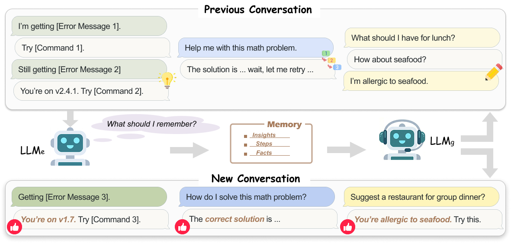
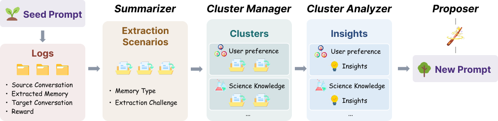

# Self-Evolving LLM Memory Extraction Across Heterogeneous Tasks

[](https://arxiv.org/abs/2604.11610)

Code and data for the paper *Self-Evolving LLM Memory Extraction Across Heterogeneous Tasks*. We formalize **heterogeneous memory extraction**, release **BEHEMOTH** (a benchmark of 18 datasets across personalization, problem-solving, and agentic tasks), and propose **CluE**, a cluster-based self-evolving framework that produces extraction prompts generalizing across heterogeneous tasks.

<p align="center">
  
</p>

> A general-purpose assistant LLMg encounters diverse previous conversations spanning technical debugging, math problem-solving, and personal preferences, from which an extraction model LLMe must produce different types of memory (e.g., reusable insights, solution steps, personal facts). LLMg then leverages these memories to improve responses in new conversations.

## Overview

We formalize **single-step memory extraction**: given a source conversation, an extraction model produces a memory string, which is injected as context for a generation model answering an associated target query. We measure quality by a downstream utility-driven reward. Under heterogeneous task distributions, no static extraction prompt dominates and existing self-evolving frameworks degrade. **CluE** addresses this by grouping training examples into clusters by extraction scenario, analyzing each cluster independently, and synthesizing cross-cluster insights into an updated prompt — **+9.04% relative gain** over the *Simple* baseline on BEHEMOTH.

<p align="center">
  
  <br/>
  <em>CluE: in each round, per-example summaries are clustered by extraction scenario, analyzed independently, and synthesized into an updated extraction prompt.</em>
</p>

## Repository Structure

```
src/
├── extraction/                   # builtin extraction system prompts + LLM extractor
│   ├── extraction_prompts.py     # Mem0 / ReasoningBank / OpenMemory / Survey / Simple / ...
│   └── llm_extractor.py
├── evolution_clue/               # CluE (main method)
│   ├── run_evolution_clue.py     # CLI: self-evolve + evaluate
│   └── core/                     # Summarizer / Cluster Manager / Analyzer / Proposer
├── evolution_gepa/               # GEPA baseline
├── evolution_ace/                # ACE baseline
├── evolution_memevolve/          # MemEvolve baseline
├── inference/                    # per-dataset inference adapters
│   └── adapters/                 # gmemory / agentboard / membench / longmemeval / ...
├── data_processing/generators/   # dataset → (source, target, reward) generators
├── evaluation/                   # per-dataset evaluation + factory dispatch
└── pipelines/
    ├── run_collection.py         # collect source conversations
    ├── run_generation.py         # build source–target pairs
    ├── run_gepa_evaluation.py    # evaluate any prompt across all BEHEMOTH datasets
    ├── run_evaluation.py
    ├── run_llm_judge_evaluation.py
    └── print_evaluation.py       # aggregate per-dataset metrics
data/                             # raw datasets (downloaded separately)
data_collection/                  # pre-built BEHEMOTH source–target pairs (Qwen3-32B)
scripts/                          # shell entrypoints wrapping the python CLIs
```

## Installation

Follow [INSTALLATION.md](INSTALLATION.md) to set up the conda environment and install all Python dependencies.

## Data

Several datasets must be downloaded separately in addition to the Python dependencies:

- **AlfWorld** — set the data directory and download via the official CLI:
  ```bash
  export ALFWORLD_DATA="data/alfworld"
  alfworld-download
  ```
- **ToolBench** — see [data/toolbench/DOWNLOAD.md](data/toolbench/DOWNLOAD.md).
- **PersonaMem-v2** — download from [huggingface.co/datasets/bowen-upenn/PersonaMem-v2](https://huggingface.co/datasets/bowen-upenn/PersonaMem-v2).

## Building BEHEMOTH

For the problem-solving and agentic datasets, we first have `LLMg` (Qwen3-32B by default) solve each task instance, and use the resulting trajectory as the **source conversation**. All datasets are then turned into `(source conversation, target query, reward)` triples.

```bash
# 1. Collect source conversations for problem-solving and agentic tasks
bash scripts/run_collection.sh

# 2. Build source–target pairs for all datasets
bash scripts/run_generation.sh
```

We also provide pre-built data for Qwen3-32B under [`data_collection/`](data_collection/), so you can skip these two steps if you only want to reproduce the main experiments.

## Static Extraction Prompts

The seven builtin extraction prompts evaluated in the paper (`mem0`, `reasoningbank`, `openmemory`, `success-failure`, `factual-experiential`, `survey`, `simple`) are defined in [src/extraction/extraction_prompts.py](src/extraction/extraction_prompts.py) and registered in `EXTRACTION_PROMPTS`. To evaluate any of them across all BEHEMOTH datasets:

```bash
python -m src.pipelines.run_gepa_evaluation \
  --split_file data_collection/train/global_split_per20.json \
  --output_dir evolution_runs/evaluation \
  --model_name openai/Qwen3-32B \
  --num_sources_per_dataset 200 \
  --run_times 3 \
  --prompt_type survey         # any key from EXTRACTION_PROMPTS, or no_memory
```

## Self-Evolving Memory Extraction with CluE

[src/evolution_clue/run_evolution_clue.py](src/evolution_clue/run_evolution_clue.py) runs the four-step CluE loop (Summarizer → Cluster Manager → Cluster Analyzer → Proposer) over `--num_rounds` rounds, then evaluates the best prompt on the in-distribution test sets:

```bash
bash scripts/run_evolution_clue.sh
```

Key flags (see `python -m src.evolution_clue.run_evolution_clue --help` for the full list):

| Flag | Default | Notes |
| --- | --- | --- |
| `--split_file` | — | global train/test split json under `data_collection/` |
| `--num_rounds` | 5 | number of evolution rounds |
| `--task_batch_x` | 35 | training batch per round |
| `--top_t` | 2 | tournament survivors per round |
| `--num_systems` | 3 | candidate prompts proposed per round |
| `--prompt_type` | `simple` | seed prompt — any key in `EXTRACTION_PROMPTS` |
| `--max_clusters` | 7 | upper bound on Cluster Manager pool |
| `--extraction_use_async` / `--extraction_async_max_concurrency` | — | async extraction speedup |
| `--work_dir` | — | rounds, logs, and `best_prompt.txt` go here |
| `--resume` | off | reuse a previous run's logs/state |

The script also re-runs `src.pipelines.run_gepa_evaluation` against the evolved prompt over every BEHEMOTH dataset. Aggregate the resulting per-dataset numbers with:

```bash
bash scripts/print_evaluation.sh
```

Baseline self-evolving frameworks (GEPA, ACE, MemEvolve) have analogous entrypoints under [`scripts/`](scripts/): [run_evolution.sh](scripts/run_evolution.sh), [run_evolution_ace.sh](scripts/run_evolution_ace.sh), [run_evolution_memevolve.sh](scripts/run_evolution_memevolve.sh).

## LLM-Judge Evaluation (LongMemEval & ToolBench)

LongMemEval and ToolBench rely on LLM-as-judge metrics. After collection/generation, score the outputs with:

```bash
bash scripts/run_llm_judge_evaluation.sh
```

By default this uses `gpt-4o` as the judge — set `OPENAI_API_KEY` / `OPENAI_API_BASE` at the top of the script before running.

## Citation

If you find this work useful, please cite:

```bibtex
@misc{yang2026selfevolvingllmmemoryextraction,
      title={Self-Evolving LLM Memory Extraction Across Heterogeneous Tasks}, 
      author={Yuqing Yang and Tengxiao Liu and Wang Bill Zhu and Taiwei Shi and Linxin Song and Robin Jia},
      year={2026},
      eprint={2604.11610},
      archivePrefix={arXiv},
      primaryClass={cs.CL},
      url={https://arxiv.org/abs/2604.11610}, 
}
```
